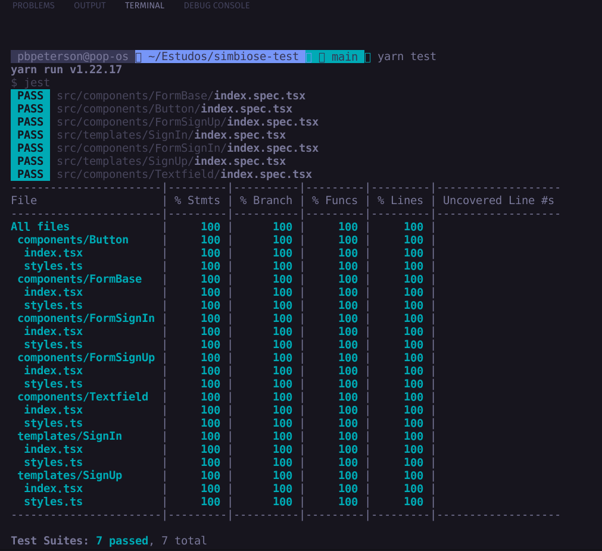

# Este é um repositório de uma tela de login simples usando NextJS e suas melhores práticas

#### Você tem a opção de visualizar o projeto no navegador. 
#### Acesse: https://prensa-login.vercel.app/

___


  Primeiramente clone o repositório em um diretório


```bash

git clone https://github.com/pbpeterson/simple-login-page

```

Em seguida entre na pasta do projeto


```bash

cd simple-login-page

```

Depois disso instale as dependencias:

  

```bash

npm install

# or

yarn install

```

Agora é só rodar o projeto com o comando

```bash

npm run dev

# or

yarn dev

```
  
  Abrirá um servidor local na porta 3000 (se ela não estiver sendo utilizada).
  E então é só abrir o seu browser e acessar  http://localhost:3000/


 # (Opcional) Execute os testes
 Desenvolver com testes unitários é a melhor forma de assegurar que os seus componentes estão fazendo o que foi proposto.
Para rodar os testes após instalar as dependencias, execute: 

```bash

npm run test

# or

yarn test

```



Ao executar os testes você verá uma cobertura de 100% 

 # (Opcional) Visualize os componentes com o storybook
Uma forma de ter componentes organizados e testar as funcionalidades no browser é usando uma ferramenta de construção de componentes isolados como o storybook, isso facilita o desenvolvedor a desenvolver componentes que sejam mais reutilizados, fáceis de dar manutenção e testar visualmente.

Para executar o storybook, execute o comando:

```bash

npm run storybook

```

Abrirá um servidor do storybook na porta 6006, e então é só abrir o browser e acessar  http://localhost:6006/
